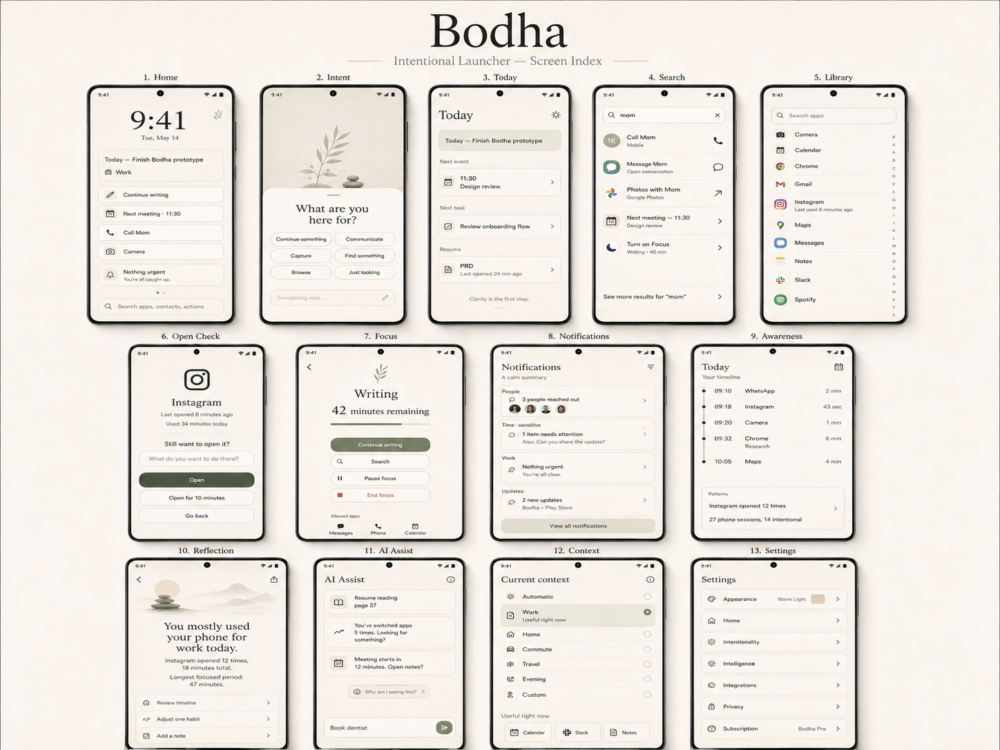

# Bodha

An intentional Android launcher. Bodha adds deliberate, user-controlled friction between you and your phone's pull — a daily intention on the home screen, a gentle prompt when you're opening apps on autopilot, a pause before the apps you choose to guard. No guilt language, no countdowns, no red. You always retain final control.



## Status

Pre-release, under active development. Product and screen specs live as [GitHub issues](../../issues); the roadmap and open decisions are in #28.

## Structure

- `engine/` — pure Kotlin decision logic: session tracking, prompt triggers, Open Check, metrics. No Android, no clocks, no I/O; everything is testable with plain events and timestamps.
- `app/` — the launcher: Jetpack Compose UI and thin adapters wiring the engine to Android. Min SDK 29.
- `backend/` — a minimal Cloudflare Worker (Bun + Hono) for auth, account deletion, and purchase association. Nothing else leaves the device.
- `docs/adr/` — locked decisions. `CONTEXT.md` — the domain glossary.

## Privacy

Zero analytics collection, by decision (ADR 0009). Usage data is read on demand from Android's own statistics and never stored; the on-device event log holds event types, timestamps, and durations — no app names, no content. The user is the only analyst.

## Building

```sh
./gradlew :app:assembleDebug                 # build
./gradlew :engine:test :app:testDebugUnitTest # tests
./gradlew :app:lintDebug                     # lint
./gradlew verifyRoborazziDebug               # screenshot gate (goldens rendered on macOS)
cd backend && bun install && bun test        # backend
```

## License

[Fair Source](https://fair.io/), FSL-1.1-ALv2: free to use, modify, and redistribute for any purpose except a competing commercial product. Each release automatically becomes Apache-2.0 two years after publication. See [LICENSE.md](LICENSE.md).
